# Architecture

## 1. Overview

The **AmazonHelp Customer Support RAG Agent** is an evidence-grounded and fail-safe customer-support system designed to classify customer requests, retrieve similar historical support cases, verify whether sufficient evidence exists, construct a conservative response from that evidence, and decide whether the request can be automatically handled or should be escalated to human support.

The implemented pipeline is:

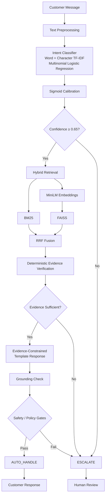

The central design principle is **fail-safe automation**:

> The system automatically responds only when confidence, evidence, grounding, and policy conditions are satisfied. Otherwise, it escalates.

---

# 2. Frozen Intent Taxonomy

The system uses a fixed six-class taxonomy:

1. **Order & Delivery Issues**
2. **Other / Human Review**
3. **Prime & Membership**
4. **Refunds & Financials**
5. **Account Security & Private Support**
6. **Returns & Exchanges**

The taxonomy is explicitly defined in the notebook and used throughout training, inference, evaluation, and decision-making.

The presence of `Other / Human Review` provides an operational fallback for requests that do not fit the supported support categories.

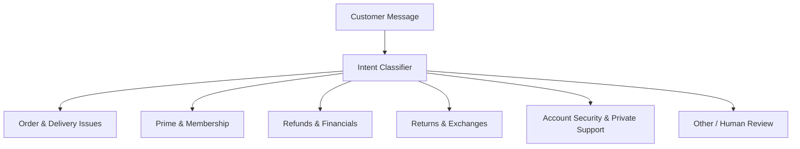

---

# 3. Data Preparation

## 3.1 Source Data

The notebook loads the locked Golden CSV:

```text
amazonhelp_golden_set_final.csv
```

The file is verified for:

* existence
* number of rows
* columns
* intent distribution

The expected Golden set size is configured as:

```text
GOLDEN_N = 200
```

The customer text is cleaned before classification.

---

## 3.2 Text Preprocessing

The preprocessing function performs:

* URL removal
* `@mention` removal
* hashtag removal
* special-character removal
* lowercasing
* whitespace tokenization

Two representations are created:

```text
clean_text()
    → token list
```

and:

```text
clean_text_str()
    → cleaned string
```

The token representation is used by BM25, while the string representation is used by the classifier.

---

# 4. Current Data-Splitting Design

The notebook currently performs a stratified:

```text
60% Train
20% Calibration
20% Validation
```

split.

The process is:

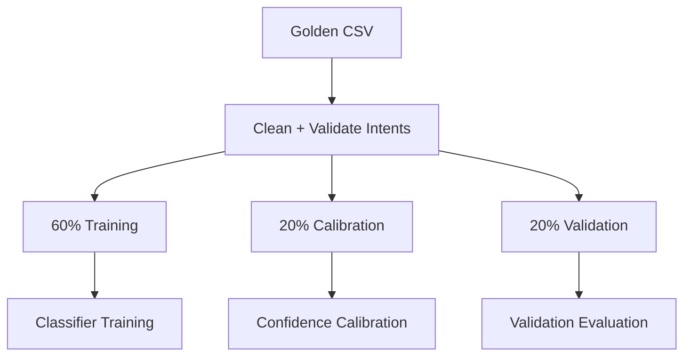

### Important implementation caveat

Although the notebook comments describe the Golden set as **"locked / evaluation-only"**, the actual code currently uses `golden_df` to construct the training, calibration, and validation sets.

Later, the same `golden_df` is passed through `run_support_agent()` again for "Golden Set Evaluation".

Therefore:

> **The current notebook does not provide a truly isolated final Golden evaluation.**

The correct production/evaluation design should instead be:

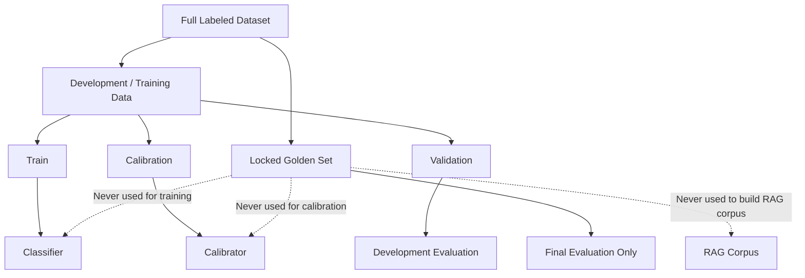

This is an important item to fix before claiming complete leakage-free evaluation.

---

# 5. Intent Classifier

The classifier combines word-level and character-level TF-IDF features.

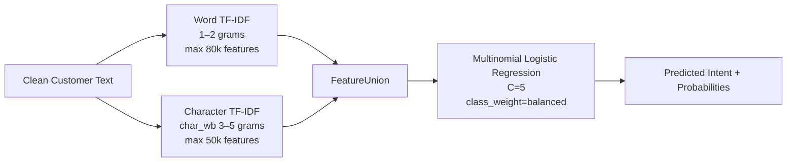

## Word TF-IDF

The word vectorizer uses:

```text
ngram_range = (1, 2)
max_features = 80,000
sublinear_tf = True
min_df = 2
```

This captures individual words and word pairs.

## Character TF-IDF

The character vectorizer uses:

```text
analyzer = char_wb
ngram_range = (3, 5)
max_features = 50,000
sublinear_tf = True
min_df = 5
```

Character features help capture variations in spelling, product terminology, and partial lexical patterns.

## Logistic Regression

The classifier uses:

```text
C = 5
class_weight = balanced
solver = lbfgs
multi_class = multinomial
max_iter = 1000
random_state = 42
```

The resulting classifier is saved as:

```text
champion_classifier.joblib
```

---

# 6. Confidence Calibration

The raw classifier is wrapped using:

```text
CalibratedClassifierCV
```

with:

```text
method = sigmoid
cv = prefit
```

The calibration data is the dedicated 20% calibration split.

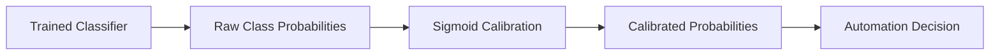

The calibrated classifier is saved as:

```text
calibrated_classifier.joblib
```

The configured automation confidence threshold is:

```text
0.65
```

Thus, a request must have:

```text
confidence >= 0.65
```

to proceed toward automatic handling.

---

# 7. RAG Corpus

The RAG corpus is constructed from the current `train_set`.

The following fields are retained:

```text
tweet_id_customer
text_customer
text_brand
intent
```

They are renamed to:

```text
tweet_id
customer_text
brand_response
intent
```

Rows without a sufficiently long brand response are removed.

Each remaining document receives a `doc_id`.

The resulting corpus contains historical:

```text
Customer Query
       +
Brand Response
       +
Intent
```

pairs.

### Current leakage implication

Because `train_set` is derived from `golden_df` in the current notebook, the RAG corpus is technically derived from the same original Golden CSV.

Therefore, although the RAG corpus does not contain the held-out validation rows from that split, the overall implementation does **not** satisfy a strict "Golden set completely isolated from development" protocol.

This should be corrected by constructing the development/training data independently of the locked Golden set.

---

# 8. Hybrid Retrieval

The retrieval layer combines two complementary retrieval strategies:

```text
BM25
+
MiniLM Dense Retrieval
+
RRF
```

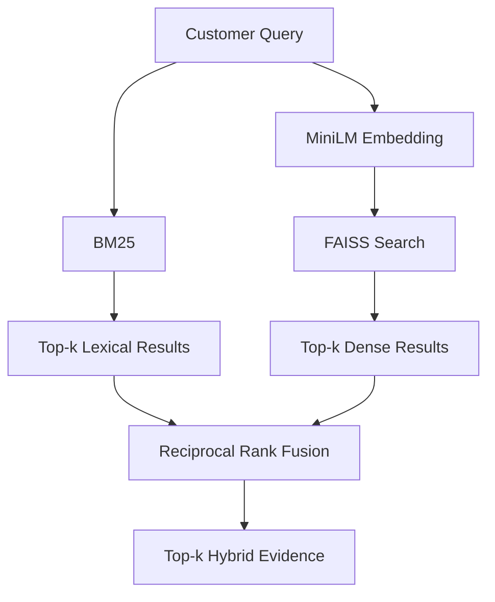

---

# 9. BM25 Retrieval

The corpus customer messages are tokenized using the preprocessing function and indexed with:

```text
BM25Okapi
```

For each query:

```text
query
  ↓
tokenization
  ↓
BM25 score
  ↓
ranked documents
```

The implementation retrieves the top 10 candidates by default.

BM25 is useful for lexical overlap between the incoming request and historical support cases.

---

# 10. Dense Retrieval

Dense retrieval uses:

```text
sentence-transformers/all-MiniLM-L6-v2
```

The corpus is encoded in batches of 64.

Embeddings are generated with:

```text
normalize_embeddings=True
```

The embeddings are stored as `float32`.

A FAISS:

```text
IndexFlatL2
```

index is then constructed.

The query is embedded using the same MiniLM model and searched against the FAISS index.

Because the embeddings are normalized, L2 distance provides a useful similarity signal for the normalized vectors.

The corpus embeddings are saved as:

```text
corpus_embeddings.npy
```

---

# 11. Reciprocal Rank Fusion

BM25 and dense retrieval results are combined using Reciprocal Rank Fusion.

The implementation uses:

```text
k = 60
```

The idea is that a document receives contributions based on its rank in each retrieval system.

A document appearing highly in both:

```text
BM25
```

and:

```text
Dense Retrieval
```

receives a stronger combined ranking.

The final hybrid retriever returns the top 10 fused results by default, while the agent requests:

```text
top_k = 5
```

for its evidence set.

---

# 12. Evidence Verification

The notebook contains an explicitly implemented **deterministic evidence verifier**.

It checks:

* whether evidence exists
* number of retrieved evidence items
* basic query/evidence keyword overlap
* whether enough evidence exists to assign an evidence level

The verifier produces:

```text
same_customer_objective
resolution_supported
conflict_detected
evidence_level
confidence
reason
```

The evidence levels are:

```text
NONE
WEAK
PARTIAL
STRONG
```

The current rules are:

```text
No evidence
    → NONE
    → confidence 0.0

1 evidence item
    → WEAK
    → confidence 0.4

2+ evidence items
    → PARTIAL
    → confidence 0.65

3+ evidence items + keyword match
    → STRONG
    → confidence 0.85
```

The keyword matching currently checks terms such as:

```text
track
refund
return
prime
```

### Important limitation

This is **not a semantic entailment verifier**.

It does not use an LLM, NLI model, cross-encoder, or formal contradiction detector. In particular, the current implementation initializes:

```text
conflict_detected = False
```

and does not actually perform robust contradiction analysis.

Therefore, the correct description is:

> **Deterministic heuristic evidence verification based primarily on evidence quantity and simple lexical matching.**

---

# 13. Response Generation

The response generation layer is intentionally conservative.

It does not perform unrestricted LLM generation.

Instead, it takes the top retrieved brand response and constructs an evidence-constrained response:

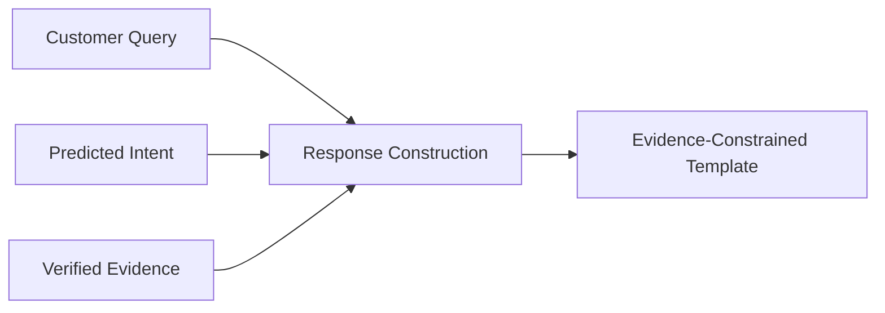

The current implementation takes:

```text
top retrieved brand_response
```

and truncates it to:

```text
150 characters
```

The response is formatted as:

```text
Based on similar cases: <retrieved response>
```

If evidence is unavailable, the system produces an escalation-oriented response instead.

The response also returns:

```text
grounding_passed
reason
```

---

# 14. End-to-End Agent

The `run_support_agent()` function implements the complete runtime pipeline.

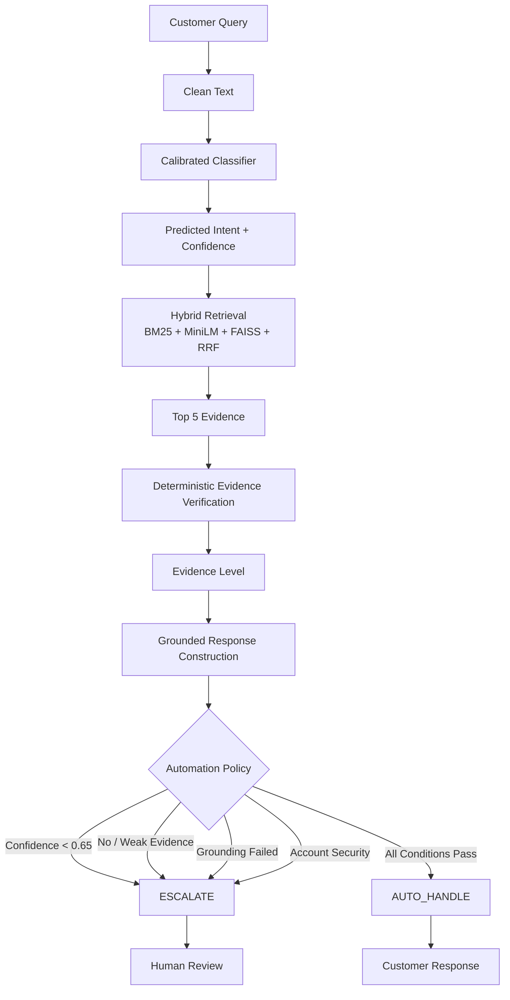

---

# 15. Automation Policy

The current implementation automatically handles a request only when all of the following conditions are satisfied:

```text
confidence >= 0.65

AND

evidence_level ∈ {STRONG, PARTIAL}

AND

grounding_passed == True

AND

predicted_intent !=
"Account Security & Private Support"
```

In simplified form:

```text
AUTO_HANDLE =
    High Confidence
    AND
    Sufficient Evidence
    AND
    Grounding Passed
    AND
    Non-Security Intent
```

Otherwise:

```text
ESCALATE
```

---

# 16. Security and Sensitive Requests

The current policy explicitly prevents automatic handling of:

```text
Account Security & Private Support
```

These cases are escalated to human support even when the classifier confidence and evidence conditions are otherwise sufficient.

This provides an explicit safety boundary around account-related requests.

The sample verification set includes:

```text
"I can't access my account. Please help!"
```

which is expected to fall under the account/security category and be handled conservatively.

---

# 17. Error Handling

The agent also fails safely when classification fails.

If the classifier raises an exception, the system returns:

```text
predicted_intent =
    Other / Human Review

confidence = 0.0

decision = ESCALATE
```

This means a model/runtime failure does not cause an automatic customer response.

Similarly, retrieval errors result in an empty evidence set, which subsequently causes the request to fail the evidence requirement and escalate.

This is consistent with the project's fail-safe design.

---

# 18. Evaluation

The notebook evaluates the system at several levels.

## 18.1 Classifier Evaluation

The classifier is evaluated using:

* Accuracy
* Macro-F1
* Weighted-F1
* Balanced Accuracy

A confusion matrix is also generated.

---

## 18.2 Validation Agent Evaluation

The complete agent is run over the validation set.

The notebook reports:

* classification accuracy
* macro-F1
* total samples
* auto-handled cases
* escalated cases
* correct auto-handles

This evaluates not only classification but also the operational behavior of the agent.

---

# 19. Golden Evaluation

The notebook contains a separate section titled:

```text
Golden Set Evaluation (LOCKED)
```

It runs the complete agent over `golden_df` and saves:

```text
golden_evaluation.csv
```

The reported metrics include:

* Accuracy
* Macro-F1
* Weighted-F1
* Auto-handled percentage
* Escalated percentage
* Correct auto-handles

### Important correction

Despite the "LOCKED" label, the same `golden_df` was previously used to create:

```text
train_set
cal_set
val_set
```

and the RAG corpus was subsequently created from `train_set`.

Therefore, the current Golden evaluation is **not an independent final test**.

This is the most important evaluation issue in the current implementation.

The correct final architecture should reserve the Golden set exclusively for final evaluation.

---

# 20. Failure Analysis

The notebook performs error analysis on the evaluated cases.

It identifies:

```text
Gold Intent
      vs
Predicted Intent
```

and reports:

* total errors
* error rate
* most common confusion pairs
* example misclassifications
* escalation reasons

This helps identify which intent boundaries are difficult for the classifier and why cases are being escalated.

---

# 21. Human Annotation and LLM Judge

## Current Status

The notebook **does not implement a separate human annotation workflow**.

The intent labels used in the notebook come from:

```text
primary_intent
```

in the loaded Golden CSV.

The notebook therefore demonstrates the use of an existing labeled dataset, but it does not document:

* independent human annotator recruitment
* multiple annotators
* annotation guidelines
* inter-annotator agreement
* adjudication
* human response-quality scoring

Similarly, the notebook **does not contain an implemented Groq LLM judge**.

Therefore, these should not currently be presented as completed components.

---

# 22. Recommended Human Validation Layer

For a final evaluation protocol, human validation should be added independently of the model's own labels.

A human reviewer can assess sampled cases on:

```text
1. Intent correctness
2. Evidence relevance
3. Evidence sufficiency
4. Response correctness
5. Response grounding
6. Safety of automation decision
7. Whether escalation was appropriate
```

A possible evaluation structure is:

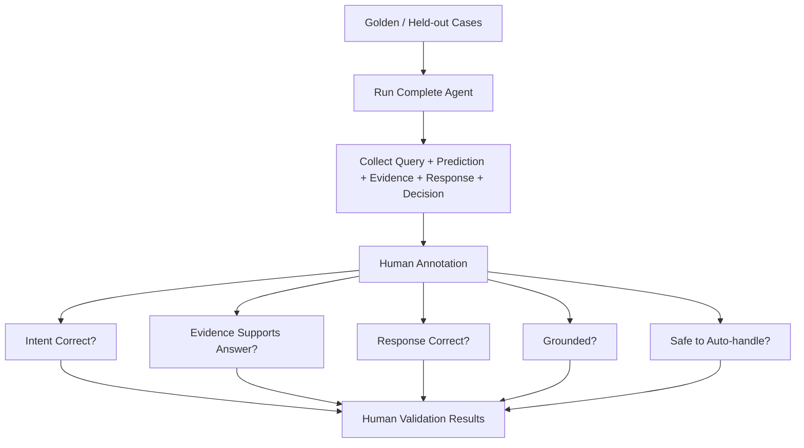

If multiple annotators are used, agreement can additionally be measured before adjudicating disagreements.

---

# 23. Recommended LLM Judge Layer

An LLM judge can be added for response-quality evaluation, but it should be treated as an **evaluation component**, not as part of the runtime support agent.

The intended architecture would be:

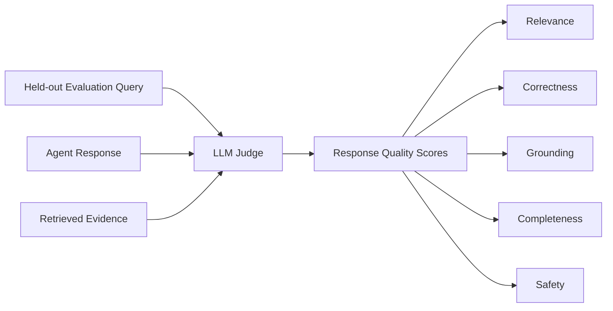

The LLM judge should complement rather than replace human validation.

The current notebook does not yet implement this layer.

---

# 24. Reproducibility

The notebook fixes the random seed:

```text
RANDOM_SEED = 42
```

and forces CPU execution for the current run:

```text
DEVICE = cpu
```

even though GPU detection is implemented.

The configuration records:

* taxonomy
* classifier configuration
* calibration method
* retrieval configuration
* evidence verification type
* response generation strategy
* safety policy
* thresholds
* data split sizes
* artifact locations
* random seed
* device

---

# 25. Saved Artifacts

The notebook creates the following artifacts:

```text
champion_classifier.joblib
calibrated_classifier.joblib
rag_corpus.csv
corpus_embeddings.npy
config.json
confusion_matrix.png
golden_evaluation.csv
verification_results.csv
```

These artifacts allow the trained classifier, calibrated model, retrieval corpus, embeddings, configuration, and evaluation outputs to be persisted.

---

# 26. Final Architecture

The implemented system can therefore be summarized as:

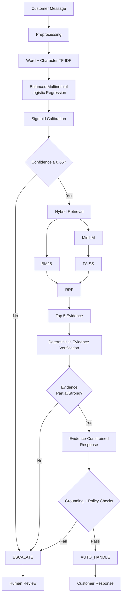

---

# 27. What the System Actually Guarantees

The current implementation provides:

* fixed six-class intent taxonomy
* word + character TF-IDF classification
* balanced multinomial Logistic Regression
* sigmoid probability calibration
* BM25 lexical retrieval
* MiniLM dense retrieval
* FAISS vector search
* RRF retrieval fusion
* deterministic evidence verification
* evidence-constrained response construction
* explicit confidence threshold
* explicit security escalation
* fail-safe escalation on errors
* validation-set evaluation
* Golden-set evaluation code
* artifact persistence
* reproducibility configuration
* end-to-end verification cases

However, the following should **not yet be claimed as completed**:

* fully independent Golden-set evaluation
* human annotation/validation study
* inter-annotator agreement
* Groq LLM judge
* semantic/NLI-based evidence verification
* robust contradiction detection
* production-grade safety classifier

---

# 28. Important Implementation Gaps to Fix

The highest-priority improvements are:

### 1. Fix Golden-set leakage

Create development/training data independently and keep the 200-example Golden set completely untouched until final evaluation.

### 2. Add genuine human validation

Have independent reviewers assess intent, evidence, response quality, grounding, and auto-handle/escalation correctness.

### 3. Add the LLM judge only as an evaluation tool

Use it to evaluate response quality, but validate a subset against human judgments.

### 4. Strengthen evidence verification

The current keyword/count heuristic is a useful baseline but does not establish true semantic support.

### 5. Improve response construction

The current response simply takes up to 150 characters from the top retrieved brand response. A stronger implementation should ensure that the response directly addresses the customer's query while remaining constrained to verified evidence.

---

# 29. Architectural Philosophy

The project is not simply:

```text
Query → Retrieve → Generate
```

It is:

```text
Query
  ↓
Classify
  ↓
Calibrate
  ↓
Retrieve
  ↓
Verify Evidence
  ↓
Construct Grounded Response
  ↓
Apply Safety / Policy Gates
  ↓
 ┌───────────────────────┐
 │                       │
AUTO_HANDLE          ESCALATE
 │                       │
Response              Human Review
```

The fundamental principle is:

> **When the system is uncertain or lacks sufficient evidence, it should fail safely by escalating rather than inventing an answer.**

This makes the architecture appropriate for customer-support automation where the cost of an incorrect automated response can be higher than the cost of sending a case to human support.
